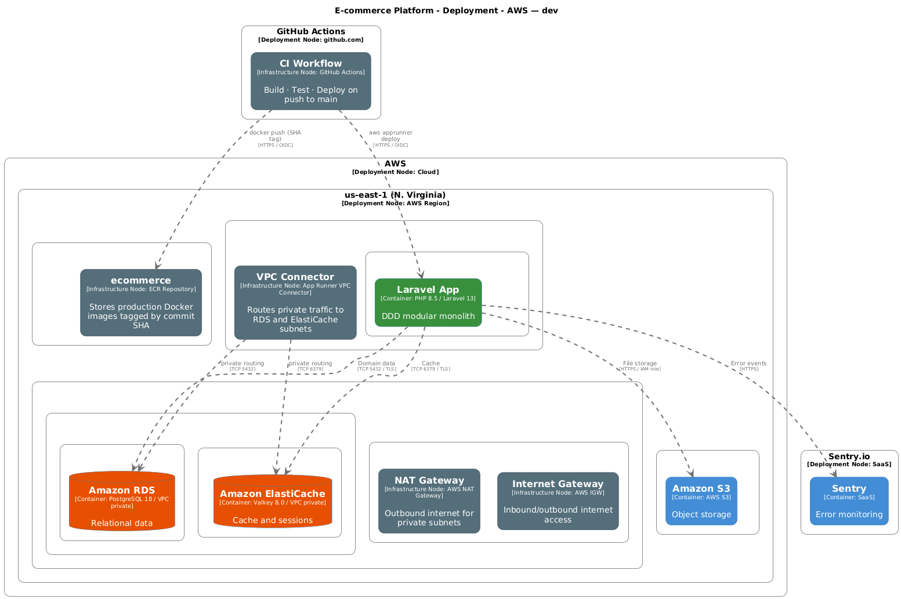
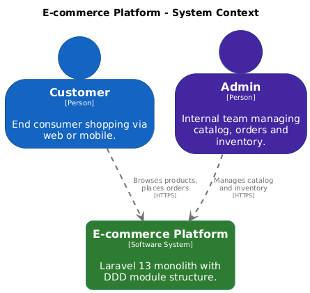
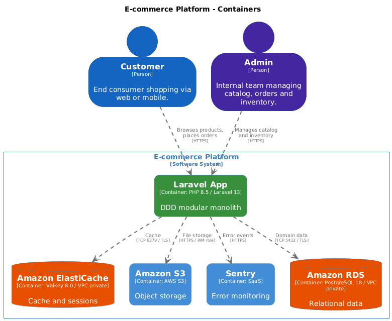
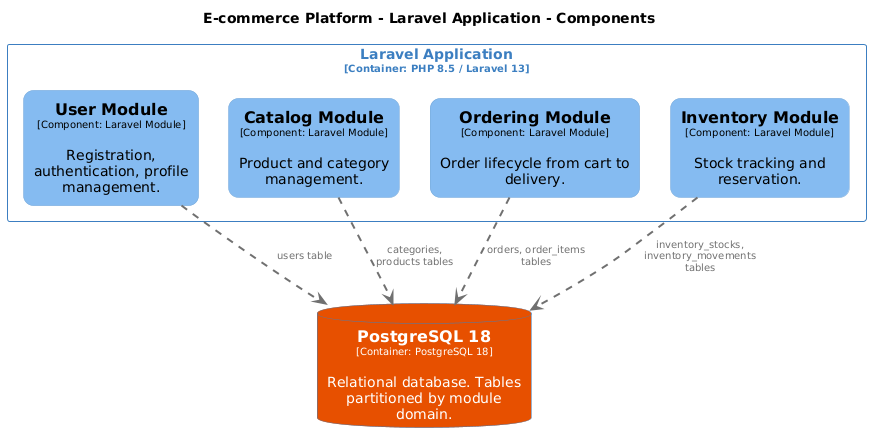

# Microservices Stateful E-commerce

[](https://github.com/yurgenlira/microservices-stateful-ecommerce/actions/workflows/ci.yml)
[](https://github.com/yurgenlira/microservices-stateful-ecommerce/actions/workflows/cd.yml)
[](https://php.net)
[](https://laravel.com)
[](https://github.com/yurgenlira/microservices-stateful-ecommerce/actions)
[](https://terraform.io)
[](https://aws.amazon.com/apprunner/)

A production-oriented e-commerce platform built as a series of progressive levels in a single repository — each level a self-contained, production-ready deliverable that builds directly on the previous one without rewrites, evolving from a containerized Laravel monolith to a fully distributed microservices architecture on Amazon EKS with GitOps, observability and platform engineering.

**Current state: Modular Monolith** — DDD modules with enforced boundaries, cloud infrastructure on AWS (App Runner + RDS + ElastiCache), full local dev via Docker Compose, and a CI pipeline with quality gates, security scanning and path-filtered jobs.

## Technical Highlights

**Containerization**

- Multi-stage Docker build — separate stages for `base`, `composer-deps`, `development` (Alpine + Xdebug for coverage) and `production` (non-root, no dev dependencies)
- Nginx embedded in both development and production images communicating with PHP-FPM via Unix socket

**CI/CD Pipeline** (GitHub Actions)

- `ci.yml` (pull_request): `changes` detects modified paths — `quality` and `build` run only when `services/app/**` changes
- `quality`: Pest with 60% coverage threshold + PHPStan L6 + Pint
- `build`: Docker multi-stage + Trivy CRITICAL CVE scan (blocks merge)
- `cd.yml` (push to main, `services/app/**` only): AWS OIDC → ECR push (GHA cache hit, no rebuild) → App Runner
- Diagrams generated locally and committed as part of the PR (`make diagrams`, `make terravision`)

**Developer Experience**

- `make project-init && make fresh` sets up the full environment from a fresh clone
- `make quality` enforces test coverage ≥ 60%, static analysis and code style in one command
- Structured JSON logging to `stderr` — compatible with CloudWatch and Grafana Loki out of the box

**Architecture as Code**

- C4 diagrams (Context, Containers, Components) in Structurizr DSL — versioned in Git, exported to PNG via `extenda/structurizr-to-png` (Puppeteer, no server required); a `pre-commit` hook blocks commits that modify the DSL without updating the exports
- ERD generated from live PostgreSQL schema via `tbls`

**Modular DDD Structure**

- Four domain modules (`User`, `Catalog`, `Ordering`, `Inventory`), each owning its migrations, factories, routes and service provider
- No cross-module database imports — domain boundaries enforced from the first commit to enable future service extraction

## Prerequisites

- Docker 27+
- Docker Compose v2
- GNU Make

## Quick Start

```bash
git clone https://github.com/yurgenlira/microservices-stateful-ecommerce.git
cd microservices-stateful-ecommerce
cp services/app/.env.example services/app/.env
make project-init
make fresh
```

App available at `http://localhost:8080`.

## Module Structure

```text
services/app/app/Modules/
├── User/
│   ├── Database/Migrations/    # users table
│   ├── Database/Factories/
│   ├── Http/Controllers/
│   ├── Http/Requests/
│   ├── Models/
│   ├── Providers/ModuleServiceProvider.php
│   ├── Routes/api.php
│   ├── Services/
│   └── Tests/
├── Catalog/                    # categories, products
├── Ordering/                   # orders, order_items, payments
└── Inventory/                  # inventory_stocks, inventory_movements
```

Each module owns its migrations, factories, routes, and service provider. No cross-module imports at the database layer.

## Architecture

Diagrams follow the [C4 model](https://c4model.com). Four levels are maintained:

| Level | Diagram | What it shows |
|---|---|---|
| L1 — Context | SystemContext | External actors (Customer, Admin) and the system boundary |
| L2 — Containers | Containers | Laravel app, RDS, ElastiCache, S3, Sentry — runtime deployables and protocols |
| L3 — Components | Components | The four DDD modules inside the Laravel app and their DB table ownership |
| L4 — Deployment | AWSDeployment | AWS topology: App Runner autoscaling, VPC, subnets, NAT, RDS, ElastiCache |



<details>
<summary>C4 model — Context · Containers · Components</summary>







</details>

> `make diagrams` — exports all PNGs using `extenda/structurizr-to-png` (Puppeteer renderer, no server required).
> `make diagrams-open` — starts Structurizr Lite locally at `http://localhost:8081` for interactive editing.

## Infrastructure


> Generated from Terraform source via Terravision — `make terravision`.

Key design decisions:

- **App Runner outside VPC** — managed compute with a VPC Connector ENI in the private subnet for egress to RDS and ElastiCache; no ingress from the VPC side
- **SG-to-SG rules, no CIDRs** — `rds-sg` accepts 5432 from `app-sg` only; `redis-sg` accepts 6379 from `app-sg` only; never a CIDR range
- **Private subnets only for data** — RDS and ElastiCache in 10.0.10.0/24; outbound via NAT Gateway in public subnet; Multi-AZ enabled in prod
- **Secrets via SSM at runtime** — `APP_KEY`, `DB_PASSWORD`, `REDIS_PASSWORD`, `SENTRY_DSN` injected from SSM Parameter Store; never baked into the image
- **Sentry at runtime** — DSN loaded from SSM; errors and releases reported over HTTPS from App Runner

## Database Schema

> Schema: [`docs/database/schema.svg`](docs/database/schema.svg) — regenerate with `make erd` (requires `make up`).

> Run `make erd` to regenerate after schema changes (requires `make up`).

## Makefile Targets

| Target | Description |
|---|---|
| `make project-init` | First-time setup: env, build, deps, hooks |
| `make hooks` | Install git hooks (lefthook) |
| `make up` | Start app services (app, postgres, redis) |
| `make down` | Stop all services |
| `make fresh` | Drop all tables, re-run migrations and seeders |
| `make shell` | Open a shell inside the app container |
| `make db` | Open a psql session |
| `make redis-cli` | Open a redis-cli session |
| `make test` | Run Pest test suite with Xdebug coverage (threshold: 60%) |
| `make lint` | Run Laravel Pint (check only) |
| `make fix` | Run Laravel Pint (auto-fix) |
| `make analyze` | Run PHPStan level 6 |
| `make quality` | Run test + lint + analyze |
| `make diagrams` | Export C4 diagrams to `docs/architecture/exports/` |
| `make diagrams-open` | Start Structurizr Lite at `http://localhost:8081` |
| `make terravision` | Generate AWS infrastructure diagram (PNG) from Terraform |
| `make erd` | Generate DB schema docs in `docs/database/` |
| `make load-smoke APP_URL=...` | Smoke test: 1 VU 30s against a deployed URL |
| `make load-test APP_URL=...` | Load test: ramp to 100 VUs to verify App Runner autoscaling |
| `make status` | Show container status |
| `make help` | Show all available targets |

## Stack

| Layer | Technology |
|---|---|
| Framework | Laravel 13 (PHP 8.5) |
| Database | PostgreSQL 18 (RDS `db.t3.micro`, 20 GB gp3, Performance Insights) |
| Cache / Sessions | Valkey 8.0 (ElastiCache `cache.t3.micro`, TLS + AUTH, DB0=cache / DB1=sessions) |
| Web server | Nginx 1.27 (embedded in app container, PHP-FPM via Unix socket) |
| Compute | AWS App Runner (1–10 instances, autoscales at 25 concurrent req/inst) |
| Storage | AWS S3 (AES256, versioning, lifecycle: temp→7d / →IA 30d) |
| Secrets | AWS SSM Parameter Store (injected at runtime, never in image) |
| Container registry | AWS ECR (images tagged by commit SHA, Trivy CRITICAL scan on every build) |
| Networking | VPC 10.0.0.0/16 — public subnets (IGW + NAT) / private subnets (RDS + ElastiCache) |
| CI/CD | GitHub Actions — OIDC auth, path-filtered quality gate, GHA layer cache, Sentry release tracking |
| Error tracking | Sentry (`sentry/sentry-laravel`, release tracking via `getsentry/action-release`) |
| Architecture docs | C4 in Structurizr DSL · Terravision for network topology |

## Environment Variables

Copy `services/app/.env.example` to `services/app/.env` and adjust if needed. Required variables:

| Variable | Description |
|---|---|
| `APP_KEY` | Generated automatically by `make project-init` |
| `DB_DATABASE` / `DB_USERNAME` / `DB_PASSWORD` | PostgreSQL credentials |
| `REDIS_PASSWORD` | Redis auth password |
| `REDIS_CACHE_DB` | Redis database index for cache (default: 0) |
| `REDIS_SESSION_DB` | Redis database index for sessions (default: 1) |

## Changelog

See [Changelog](CHANGELOG.md)
