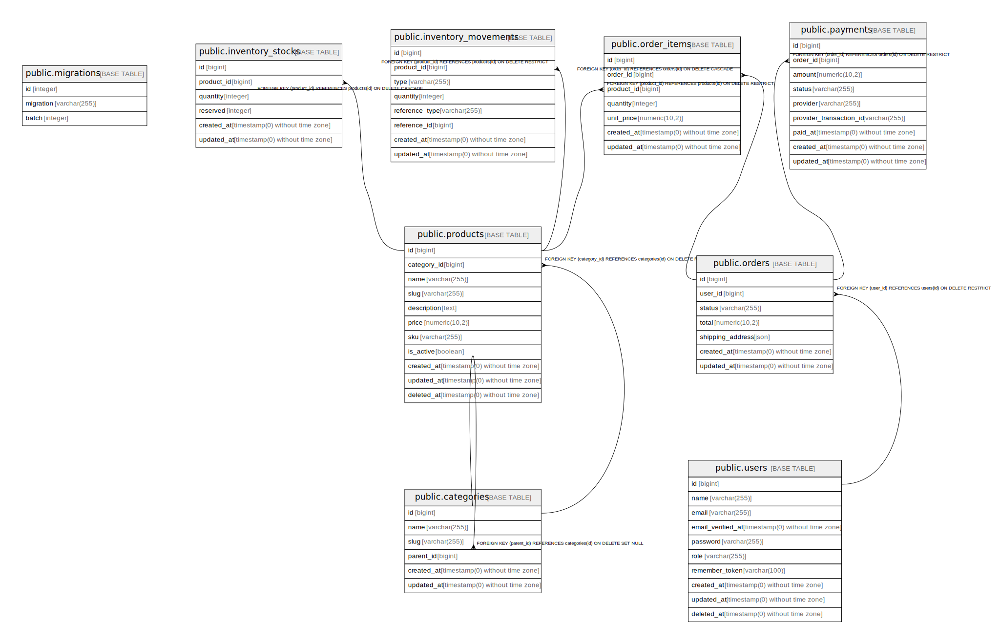

# ecommerce

## Tables

| Name | Columns | Comment | Type |
| ---- | ------- | ------- | ---- |
| [public.migrations](public.migrations.md) | 3 |  | BASE TABLE |
| [public.users](public.users.md) | 10 |  | BASE TABLE |
| [public.categories](public.categories.md) | 6 |  | BASE TABLE |
| [public.products](public.products.md) | 11 |  | BASE TABLE |
| [public.orders](public.orders.md) | 7 |  | BASE TABLE |
| [public.order_items](public.order_items.md) | 7 |  | BASE TABLE |
| [public.payments](public.payments.md) | 9 |  | BASE TABLE |
| [public.inventory_stocks](public.inventory_stocks.md) | 6 |  | BASE TABLE |
| [public.inventory_movements](public.inventory_movements.md) | 8 |  | BASE TABLE |

## Relations

---

> Generated by [tbls](https://github.com/k1LoW/tbls)
