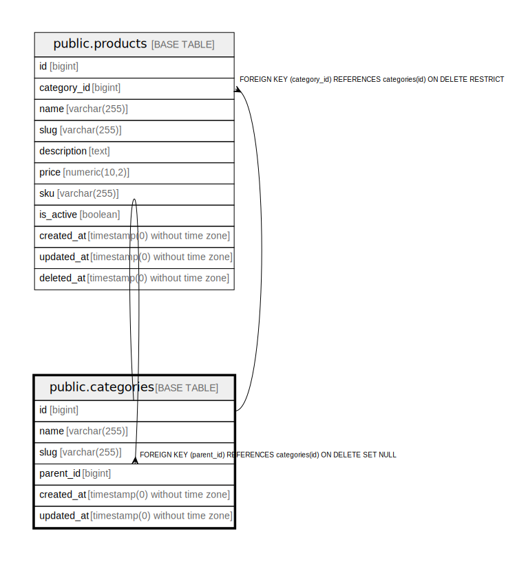

# public.categories

## Columns

| Name | Type | Default | Nullable | Children | Parents | Comment |
| ---- | ---- | ------- | -------- | -------- | ------- | ------- |
| id | bigint | nextval('categories_id_seq'::regclass) | false | [public.categories](public.categories.md) [public.products](public.products.md) |  |  |
| name | varchar(255) |  | false |  |  |  |
| slug | varchar(255) |  | false |  |  |  |
| parent_id | bigint |  | true |  | [public.categories](public.categories.md) |  |
| created_at | timestamp(0) without time zone |  | true |  |  |  |
| updated_at | timestamp(0) without time zone |  | true |  |  |  |

## Constraints

| Name | Type | Definition |
| ---- | ---- | ---------- |
| categories_id_not_null | n | NOT NULL id |
| categories_name_not_null | n | NOT NULL name |
| categories_slug_not_null | n | NOT NULL slug |
| categories_parent_id_foreign | FOREIGN KEY | FOREIGN KEY (parent_id) REFERENCES categories(id) ON DELETE SET NULL |
| categories_pkey | PRIMARY KEY | PRIMARY KEY (id) |
| categories_slug_unique | UNIQUE | UNIQUE (slug) |

## Indexes

| Name | Definition |
| ---- | ---------- |
| categories_pkey | CREATE UNIQUE INDEX categories_pkey ON public.categories USING btree (id) |
| categories_slug_unique | CREATE UNIQUE INDEX categories_slug_unique ON public.categories USING btree (slug) |

## Relations

---

> Generated by [tbls](https://github.com/k1LoW/tbls)
