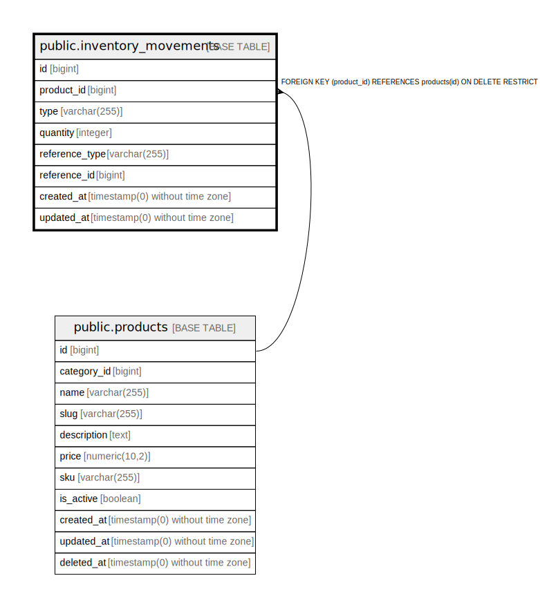

# public.inventory_movements

## Columns

| Name | Type | Default | Nullable | Children | Parents | Comment |
| ---- | ---- | ------- | -------- | -------- | ------- | ------- |
| id | bigint | nextval('inventory_movements_id_seq'::regclass) | false |  |  |  |
| product_id | bigint |  | false |  | [public.products](public.products.md) |  |
| type | varchar(255) |  | false |  |  |  |
| quantity | integer |  | false |  |  |  |
| reference_type | varchar(255) |  | true |  |  |  |
| reference_id | bigint |  | true |  |  |  |
| created_at | timestamp(0) without time zone |  | true |  |  |  |
| updated_at | timestamp(0) without time zone |  | true |  |  |  |

## Constraints

| Name | Type | Definition |
| ---- | ---- | ---------- |
| inventory_movements_id_not_null | n | NOT NULL id |
| inventory_movements_product_id_not_null | n | NOT NULL product_id |
| inventory_movements_quantity_not_null | n | NOT NULL quantity |
| inventory_movements_type_check | CHECK | CHECK (((type)::text = ANY ((ARRAY['purchase'::character varying, 'sale'::character varying, 'reservation'::character varying, 'release'::character varying, 'adjustment'::character varying])::text[]))) |
| inventory_movements_type_not_null | n | NOT NULL type |
| inventory_movements_product_id_foreign | FOREIGN KEY | FOREIGN KEY (product_id) REFERENCES products(id) ON DELETE RESTRICT |
| inventory_movements_pkey | PRIMARY KEY | PRIMARY KEY (id) |

## Indexes

| Name | Definition |
| ---- | ---------- |
| inventory_movements_pkey | CREATE UNIQUE INDEX inventory_movements_pkey ON public.inventory_movements USING btree (id) |
| inventory_movements_reference_type_reference_id_index | CREATE INDEX inventory_movements_reference_type_reference_id_index ON public.inventory_movements USING btree (reference_type, reference_id) |
| inventory_movements_product_id_type_index | CREATE INDEX inventory_movements_product_id_type_index ON public.inventory_movements USING btree (product_id, type) |

## Relations

---

> Generated by [tbls](https://github.com/k1LoW/tbls)
