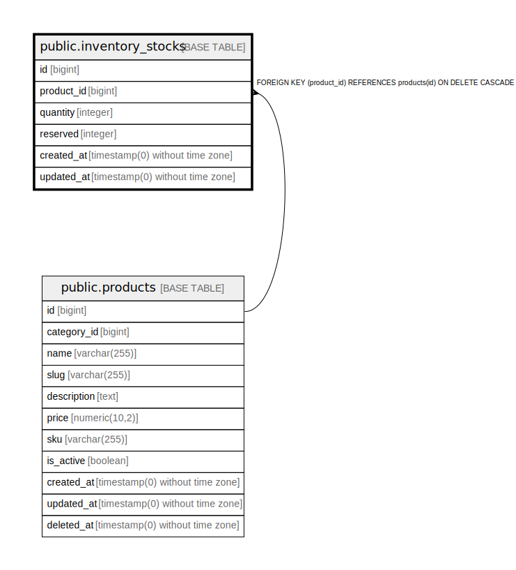

# public.inventory_stocks

## Columns

| Name | Type | Default | Nullable | Children | Parents | Comment |
| ---- | ---- | ------- | -------- | -------- | ------- | ------- |
| id | bigint | nextval('inventory_stocks_id_seq'::regclass) | false |  |  |  |
| product_id | bigint |  | false |  | [public.products](public.products.md) |  |
| quantity | integer | 0 | false |  |  |  |
| reserved | integer | 0 | false |  |  |  |
| created_at | timestamp(0) without time zone |  | true |  |  |  |
| updated_at | timestamp(0) without time zone |  | true |  |  |  |

## Constraints

| Name | Type | Definition |
| ---- | ---- | ---------- |
| inventory_stocks_id_not_null | n | NOT NULL id |
| inventory_stocks_product_id_not_null | n | NOT NULL product_id |
| inventory_stocks_quantity_not_null | n | NOT NULL quantity |
| inventory_stocks_reserved_not_null | n | NOT NULL reserved |
| inventory_stocks_product_id_foreign | FOREIGN KEY | FOREIGN KEY (product_id) REFERENCES products(id) ON DELETE CASCADE |
| inventory_stocks_pkey | PRIMARY KEY | PRIMARY KEY (id) |
| inventory_stocks_product_id_unique | UNIQUE | UNIQUE (product_id) |

## Indexes

| Name | Definition |
| ---- | ---------- |
| inventory_stocks_pkey | CREATE UNIQUE INDEX inventory_stocks_pkey ON public.inventory_stocks USING btree (id) |
| inventory_stocks_product_id_unique | CREATE UNIQUE INDEX inventory_stocks_product_id_unique ON public.inventory_stocks USING btree (product_id) |

## Relations

---

> Generated by [tbls](https://github.com/k1LoW/tbls)
