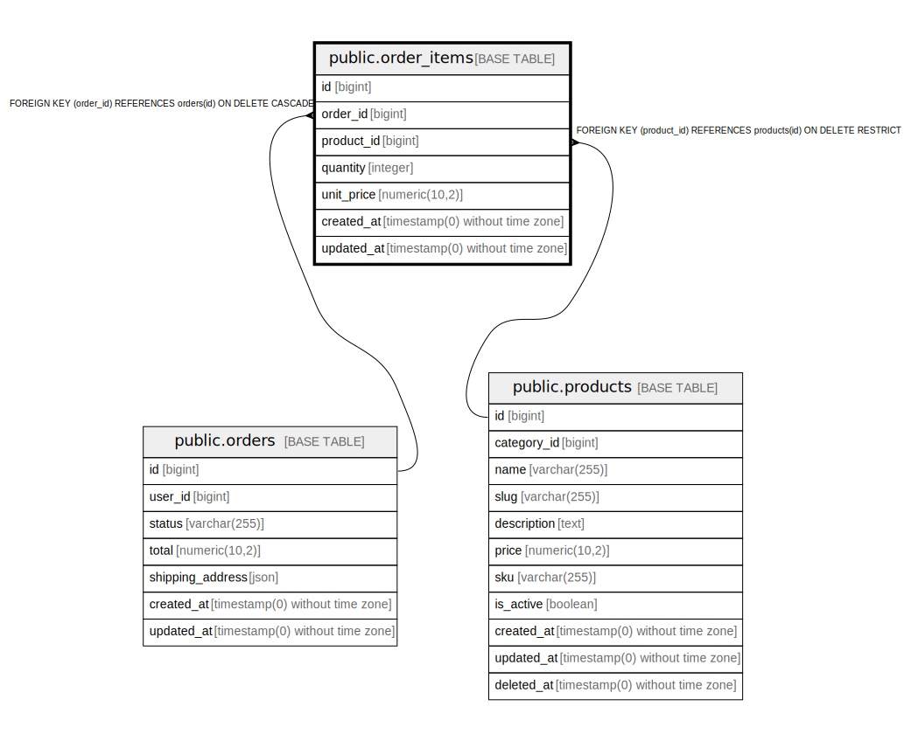

# public.order_items

## Columns

| Name | Type | Default | Nullable | Children | Parents | Comment |
| ---- | ---- | ------- | -------- | -------- | ------- | ------- |
| id | bigint | nextval('order_items_id_seq'::regclass) | false |  |  |  |
| order_id | bigint |  | false |  | [public.orders](public.orders.md) |  |
| product_id | bigint |  | false |  | [public.products](public.products.md) |  |
| quantity | integer |  | false |  |  |  |
| unit_price | numeric(10,2) |  | false |  |  |  |
| created_at | timestamp(0) without time zone |  | true |  |  |  |
| updated_at | timestamp(0) without time zone |  | true |  |  |  |

## Constraints

| Name | Type | Definition |
| ---- | ---- | ---------- |
| order_items_id_not_null | n | NOT NULL id |
| order_items_order_id_not_null | n | NOT NULL order_id |
| order_items_product_id_not_null | n | NOT NULL product_id |
| order_items_quantity_not_null | n | NOT NULL quantity |
| order_items_unit_price_not_null | n | NOT NULL unit_price |
| order_items_product_id_foreign | FOREIGN KEY | FOREIGN KEY (product_id) REFERENCES products(id) ON DELETE RESTRICT |
| order_items_order_id_foreign | FOREIGN KEY | FOREIGN KEY (order_id) REFERENCES orders(id) ON DELETE CASCADE |
| order_items_pkey | PRIMARY KEY | PRIMARY KEY (id) |

## Indexes

| Name | Definition |
| ---- | ---------- |
| order_items_pkey | CREATE UNIQUE INDEX order_items_pkey ON public.order_items USING btree (id) |
| order_items_order_id_index | CREATE INDEX order_items_order_id_index ON public.order_items USING btree (order_id) |

## Relations

---

> Generated by [tbls](https://github.com/k1LoW/tbls)
