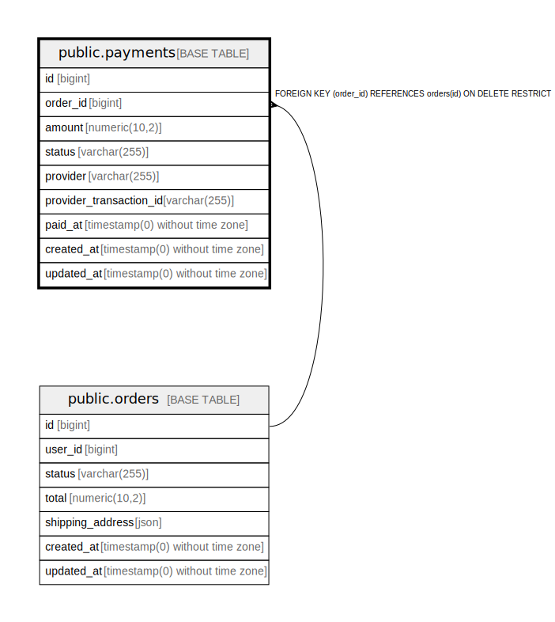

# public.payments

## Columns

| Name | Type | Default | Nullable | Children | Parents | Comment |
| ---- | ---- | ------- | -------- | -------- | ------- | ------- |
| id | bigint | nextval('payments_id_seq'::regclass) | false |  |  |  |
| order_id | bigint |  | false |  | [public.orders](public.orders.md) |  |
| amount | numeric(10,2) |  | false |  |  |  |
| status | varchar(255) | 'pending'::character varying | false |  |  |  |
| provider | varchar(255) |  | true |  |  |  |
| provider_transaction_id | varchar(255) |  | true |  |  |  |
| paid_at | timestamp(0) without time zone |  | true |  |  |  |
| created_at | timestamp(0) without time zone |  | true |  |  |  |
| updated_at | timestamp(0) without time zone |  | true |  |  |  |

## Constraints

| Name | Type | Definition |
| ---- | ---- | ---------- |
| payments_amount_not_null | n | NOT NULL amount |
| payments_id_not_null | n | NOT NULL id |
| payments_order_id_not_null | n | NOT NULL order_id |
| payments_status_check | CHECK | CHECK (((status)::text = ANY ((ARRAY['pending'::character varying, 'completed'::character varying, 'failed'::character varying, 'refunded'::character varying])::text[]))) |
| payments_status_not_null | n | NOT NULL status |
| payments_order_id_foreign | FOREIGN KEY | FOREIGN KEY (order_id) REFERENCES orders(id) ON DELETE RESTRICT |
| payments_pkey | PRIMARY KEY | PRIMARY KEY (id) |

## Indexes

| Name | Definition |
| ---- | ---------- |
| payments_pkey | CREATE UNIQUE INDEX payments_pkey ON public.payments USING btree (id) |
| payments_order_id_index | CREATE INDEX payments_order_id_index ON public.payments USING btree (order_id) |
| payments_status_index | CREATE INDEX payments_status_index ON public.payments USING btree (status) |

## Relations

---

> Generated by [tbls](https://github.com/k1LoW/tbls)
