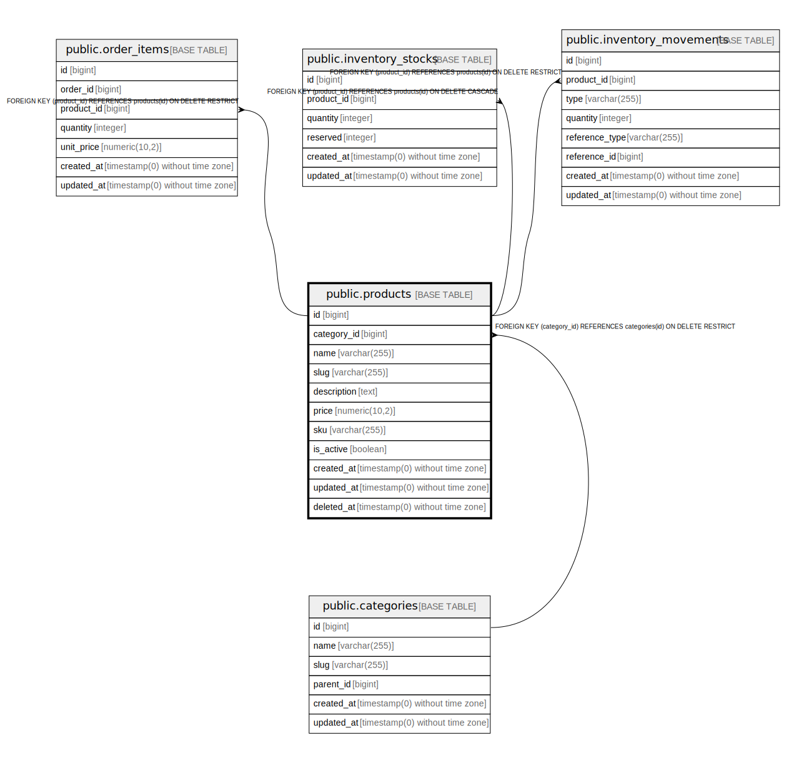

# public.products

## Columns

| Name | Type | Default | Nullable | Children | Parents | Comment |
| ---- | ---- | ------- | -------- | -------- | ------- | ------- |
| id | bigint | nextval('products_id_seq'::regclass) | false | [public.order_items](public.order_items.md) [public.inventory_stocks](public.inventory_stocks.md) [public.inventory_movements](public.inventory_movements.md) |  |  |
| category_id | bigint |  | false |  | [public.categories](public.categories.md) |  |
| name | varchar(255) |  | false |  |  |  |
| slug | varchar(255) |  | false |  |  |  |
| description | text |  | true |  |  |  |
| price | numeric(10,2) |  | false |  |  |  |
| sku | varchar(255) |  | false |  |  |  |
| is_active | boolean | true | false |  |  |  |
| created_at | timestamp(0) without time zone |  | true |  |  |  |
| updated_at | timestamp(0) without time zone |  | true |  |  |  |
| deleted_at | timestamp(0) without time zone |  | true |  |  |  |

## Constraints

| Name | Type | Definition |
| ---- | ---- | ---------- |
| products_category_id_not_null | n | NOT NULL category_id |
| products_id_not_null | n | NOT NULL id |
| products_is_active_not_null | n | NOT NULL is_active |
| products_name_not_null | n | NOT NULL name |
| products_price_not_null | n | NOT NULL price |
| products_sku_not_null | n | NOT NULL sku |
| products_slug_not_null | n | NOT NULL slug |
| products_category_id_foreign | FOREIGN KEY | FOREIGN KEY (category_id) REFERENCES categories(id) ON DELETE RESTRICT |
| products_pkey | PRIMARY KEY | PRIMARY KEY (id) |
| products_slug_unique | UNIQUE | UNIQUE (slug) |
| products_sku_unique | UNIQUE | UNIQUE (sku) |

## Indexes

| Name | Definition |
| ---- | ---------- |
| products_pkey | CREATE UNIQUE INDEX products_pkey ON public.products USING btree (id) |
| products_sku_index | CREATE INDEX products_sku_index ON public.products USING btree (sku) |
| products_category_id_index | CREATE INDEX products_category_id_index ON public.products USING btree (category_id) |
| products_is_active_created_at_index | CREATE INDEX products_is_active_created_at_index ON public.products USING btree (is_active, created_at) |
| products_slug_unique | CREATE UNIQUE INDEX products_slug_unique ON public.products USING btree (slug) |
| products_sku_unique | CREATE UNIQUE INDEX products_sku_unique ON public.products USING btree (sku) |

## Relations

---

> Generated by [tbls](https://github.com/k1LoW/tbls)
