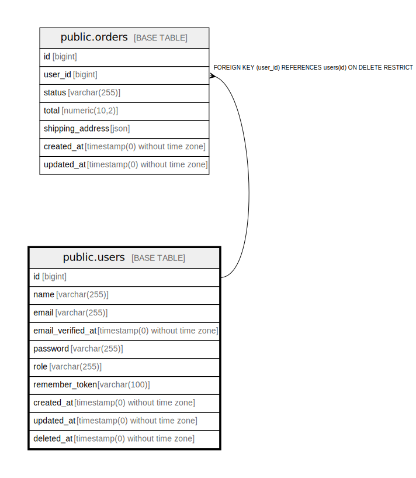

# public.users

## Columns

| Name | Type | Default | Nullable | Children | Parents | Comment |
| ---- | ---- | ------- | -------- | -------- | ------- | ------- |
| id | bigint | nextval('users_id_seq'::regclass) | false | [public.orders](public.orders.md) |  |  |
| name | varchar(255) |  | false |  |  |  |
| email | varchar(255) |  | false |  |  |  |
| email_verified_at | timestamp(0) without time zone |  | true |  |  |  |
| password | varchar(255) |  | false |  |  |  |
| role | varchar(255) | 'customer'::character varying | false |  |  |  |
| remember_token | varchar(100) |  | true |  |  |  |
| created_at | timestamp(0) without time zone |  | true |  |  |  |
| updated_at | timestamp(0) without time zone |  | true |  |  |  |
| deleted_at | timestamp(0) without time zone |  | true |  |  |  |

## Constraints

| Name | Type | Definition |
| ---- | ---- | ---------- |
| users_email_not_null | n | NOT NULL email |
| users_id_not_null | n | NOT NULL id |
| users_name_not_null | n | NOT NULL name |
| users_password_not_null | n | NOT NULL password |
| users_role_check | CHECK | CHECK (((role)::text = ANY ((ARRAY['customer'::character varying, 'admin'::character varying])::text[]))) |
| users_role_not_null | n | NOT NULL role |
| users_pkey | PRIMARY KEY | PRIMARY KEY (id) |
| users_email_unique | UNIQUE | UNIQUE (email) |

## Indexes

| Name | Definition |
| ---- | ---------- |
| users_pkey | CREATE UNIQUE INDEX users_pkey ON public.users USING btree (id) |
| users_role_index | CREATE INDEX users_role_index ON public.users USING btree (role) |
| users_email_unique | CREATE UNIQUE INDEX users_email_unique ON public.users USING btree (email) |

## Relations

---

> Generated by [tbls](https://github.com/k1LoW/tbls)
